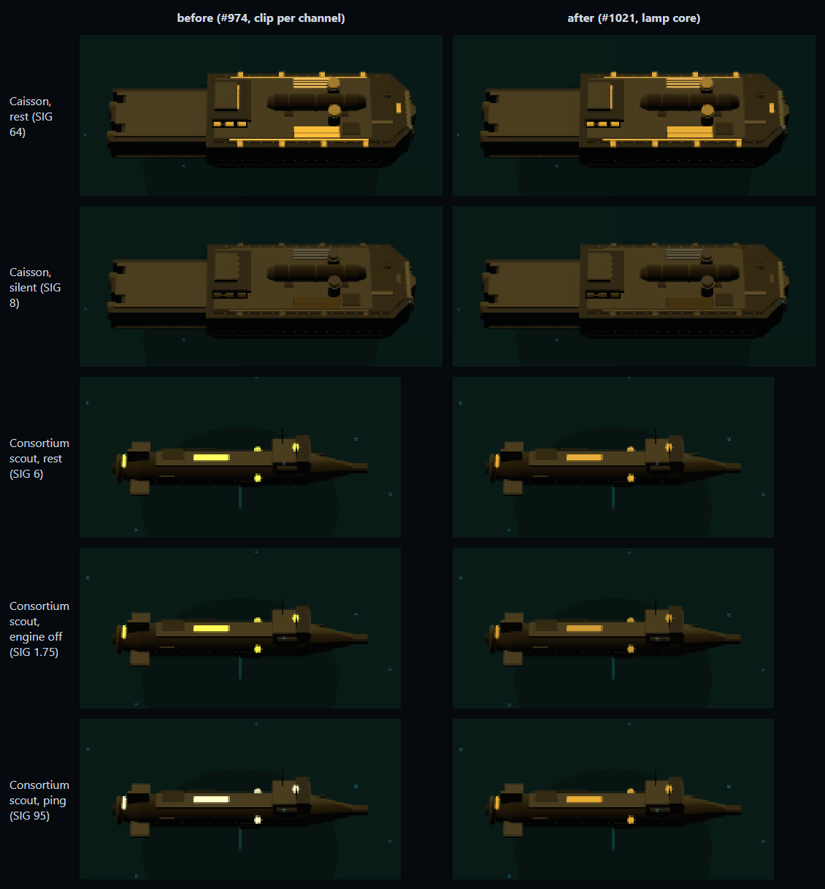

# #1021 — gate 3's lamp core, before and after

Gate 3's lamp core ([graphics-standards.md](../../graphics-standards.md) gate 3): a lamp
whose export rests past white in its brightest channel rests at white along its faction's
glow ink, worked out after the palette recolour, and a pixel a louder state drives past
white is scaled along its hue instead of clipped channel by channel. Under the standard
palette 50 of 151 roster lamp materials, on 42 models, are held at white; under
deuteranopia and protanopia 72 on 54, and under tritanopia 58 on 49. No GLB changes.
`packages/frontend/test/lampCore.test.mjs` holds every lamp in every palette.

Hardware for everything below: GTX 1070 through ANGLE/Direct3D 11, headed Edge,
1440×900. The "before" is [issue-974](../issue-974/README.md)'s lamp readings and
[issue-1001](../issue-1001/README.md)'s GPU readings; the "after" is commit `944524da`.

## The lamps (`lamps-standard/`, `lamps-tutorial/`)

`node .claude/skills/run-game/scripts/drive.mjs --headed --channel msedge --url
'http://localhost:5173/?map=ventfront-divide' --out <dir> --steps
tools/render-stack/lamps.mjs`, and `?mission=prologue-sorrowgate` for the tutorial.
`lamps.mjs` now asserts each lamp's resting brightest channel is at or under white.

| Hull, state | Before: max v / clipped / brightest 1% hue, saturation | After |
| --- | --- | --- |
| Caisson, rest (SIG 64) | 1.00 / 99 / 39.7°, 0.71 | 0.91 / 0 / 39.9°, 0.76 |
| Caisson, silent (SIG 8) | 0.40 / 0 / 44.9°, 0.45 | 0.39 / 0 / 45.8°, 0.44 |
| Consortium scout, rest (SIG 6) | 1.00 / 85 / 58.3°, 0.62 | 0.91 / 0 / 41.1°, 0.71 |
| Consortium scout, engine off (SIG 1.75) | 1.00 / 85 / 57.4°, 0.66 | 0.82 / 0 / 41.6°, 0.71 |
| Consortium scout, ping (SIG 95) | 1.00 / 85 / 57.8°, 0.29 | 0.91 / 0 / 41.6°, 0.72 |
| Commune scout, rest (SIG 6) | 1.00 / 5 / 169.1°, 0.84 | 0.91 / 0 / 169.1°, 0.84 |
| Commune scout, engine off (SIG 1.75) | 0.89 / 0 / 169.6°, 0.85 | 0.81 / 0 / 169.9°, 0.85 |

The ink `#F2B233` is 39.9° as stored. The Consortium scout rested at 3.5 times its ink and
is held at 1.126; it now draws amber rather than yellow, and with its engine off it drops
from 0.91 to 0.82, about 22 of 255 steps, where before it did not move. Its rest-minus-
engine-off emission is now amber (29.0° against the ink's linear 28.9°; before, teal
noise from a clipped red). Its ping no longer whitens it, and no longer flares on the
lamp either: a lamp held at white has no headroom, and the loudness collar carries the
ping, as gate 3 says. The Caisson's lamp rests under white and is not held; what clipped
was lit surface under it, which the pixel half now scales. The Commune scout rested at
1.6 and is held at 1.302.

## GPU time (`gpu-after/`)

Unpaced, as gate 6 reads it; average GPU ms, before (issue-1001) → after.

| Camera | Ratio 1 | Ratio 1 repeat | Ratio 1.5 | Ratio 1.5 repeat |
| --- | --- | --- | --- | --- |
| Ventfront home | 0.46 → 0.51 | 0.57 → 0.50 | 0.69 → 0.66 | 0.64 → 0.61 |
| Ventfront close | 0.49 → 0.53 | 0.47 → 0.45 | 0.75 → 0.71 | 0.75 → 0.74 |
| Ventfront low | 0.42 → 0.48 | 0.44 → 0.46 | 0.62 → 0.60 | 0.61 → 0.69 |
| Ventfront survey | 0.43 → 0.45 | 0.37 → 0.44 | 0.59 → 0.59 | 0.54 → 0.58 |
| Sorrowgate home | 0.35 → 0.34 | | 0.52 → 0.50 | |
| Sorrowgate close | 0.40 → 0.40 | | 0.68 → 0.65 | |
| Sorrowgate low | 0.35 → 0.37 | | 0.53 → 0.51 | |
| Sorrowgate survey | 0.24 → 0.26 | | 0.34 → 0.32 | |
| Ventfront fight station | 0.62 → 0.69 | | 0.85 → 0.88 | |

Every change is within 0.08 ms either way, inside the 0.11 ms two runs of one camera
already differed by, and calls and triangles are unchanged (55 / 148,290 Ventfront, 45–46
/ 47,422 Sorrowgate, 57 at the fight station): gate 6 allocates the lamp core nothing.

## Related

[graphics-standards.md](../../graphics-standards.md) gates 3 and 6 ·
[issue-974](../issue-974/README.md) · [issue-1001](../issue-1001/README.md)
