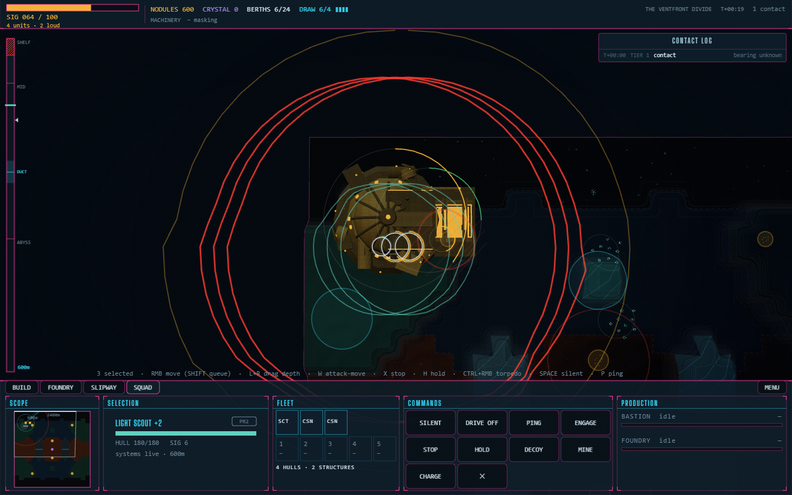
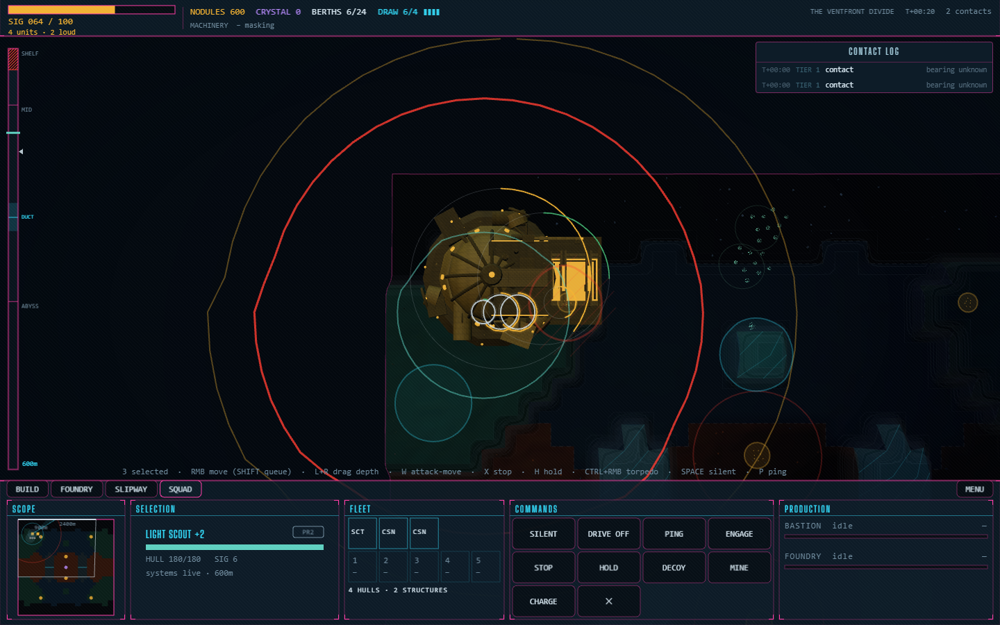

# #1330 — the ping preview rings the hull that pings

The Consortium's opening on the Ventfront Divide, every hull that fights
selected with `0` (a Light Scout and two Caissons, `selection.json`), seen from
9 km straight above, with Alt held for the ping preview.

| | |
| --- | --- |
|  |  |
| **Before** — the 900 m reveal and the 2,400 m self-reveal round all three selected hulls, though `P` pings from one | **After** — one pair, round the hull `P` pings from |

Driven with `docs/screenshots/issue-1330/drive.mjs`: the after frame from the
branch, the before frame from the same running server with `main`'s
`EchoRenderer.ts` written over the branch's and restored after.
