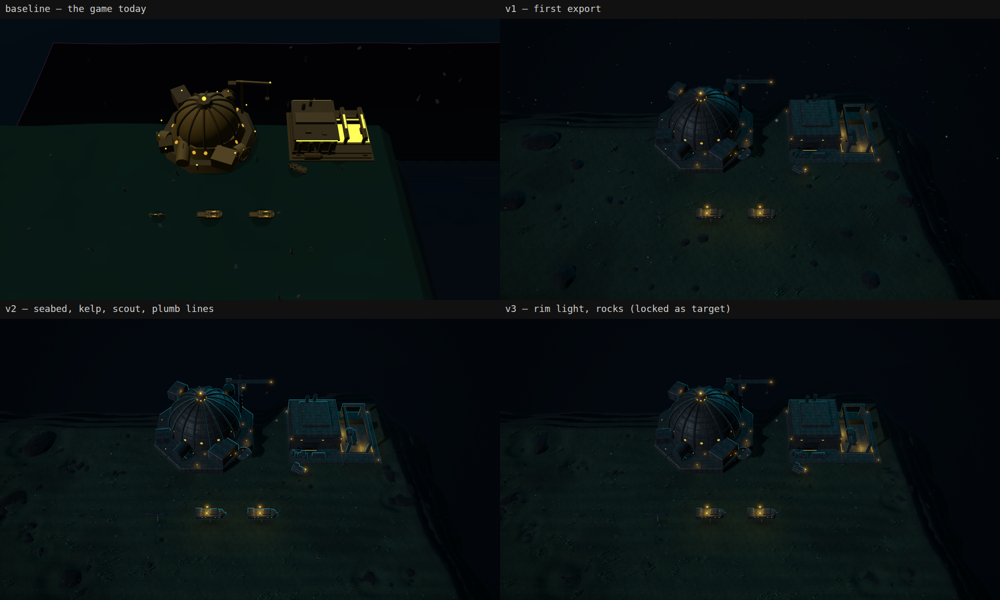

# Dream-loop target: the conn view's home frame

Evidence for [#967](https://github.com/gunnargehtab/Echoes-of-the-Abyss/issues/967): the locked
target the dream loop builds toward, how it was made, and what to watch for while the loop
runs.



## Files

| File | What it is |
| --- | --- |
| `target.png` | The locked target: round 3 of the Claude Design export, 1920×1080. |
| `target.html` | That export as downloaded. `render-target.cjs` turns it back into `target.png` byte for byte. |
| `baseline.png` | The game before the loop, in the same frame, HUD hidden. |
| `rounds.png` | The baseline and the three rounds, side by side. |
| `shoot.mjs` | A `run-game` steps module that shoots the loop's frame from the running game. |
| `measure.mjs` | The locked shot followed by a ten-second GPU measurement. |
| `review.mjs` | The same shot and measurement, then low, overhead, survey and panning controls. |
| `render-target.cjs` | Renders a Claude Design export headless at 1920×1080, DPR 1. |

## The frame

- A solo match on the Ventfront Divide, from the Bathyarch Consortium seat, with the base as
  it opens.
- Camera: `window.__perspectiveCamera(1340, 1300, 1500, { yawDeg: 0, pitchDeg: 55, focusDepthM: null })`.
  That is a focus at x 1,340 m and z 1,300 m, a 1,500 dolly, 55° pitch, facing north,
  through the view's fixed 40° field of view.
- Viewport 1920×1080 at DPR 1. Wait 7 s for the GLBs to replace the baked sprites.
- No HUD toggle exists, so `shoot.mjs` hides every canvas after the first (the three.js
  world) and every DOM overlay.
- The Harvester works its field and moves between shots. Everything else holds still.

## Running the loop

1. Copy `target.png` to `.dream-loop/target.png`. That folder is gitignored scratch.
2. Register the skill as [optional-skills/README.md](../../../optional-skills/README.md)
   describes, and take the Pro workflow.
3. Each round, start the game with `.claude/skills/run-game/scripts/dev.sh start` and shoot:

   ```bash
   VIEW_W=1920 VIEW_H=1080 node .claude/skills/run-game/scripts/drive.mjs \
     --out .dream-loop/shots --steps docs/screenshots/issue-967/shoot.mjs
   ```

4. Judge each shot against `target.png`, as the skill's judge prompt says.

### Development-only prototype

Open `http://localhost:5173/?dream-loop=1` to enable the material study. Without that
explicit opt-in, or in a production build, the shipped appearance is unchanged.
On Windows, the existing development servers can be driven with:

```powershell
$env:VIEW_W='1920'; $env:VIEW_H='1080'
$env:DREAM_METRICS='.dream-loop\metrics.json'
node .claude\skills\run-game\scripts\drive.mjs --headed --channel msedge `
  --url 'http://localhost:5173/?dream-loop=1' --out .dream-loop\shots `
  --steps docs\screenshots\issue-967\measure.mjs
```

`measure.mjs` calls the unchanged `shoot.mjs`, then measures a separate ten-second station.
Round 1's [live frame](prototype-1.png) and [reading](prototype-1-metrics.json) show
60.1 FPS on a GTX 1070 through ANGLE/D3D11, 55 draw calls and 148,290 triangles.
The first pass is incomplete: regular brick-like platework, sparse vegetation and flat
ground still differ from the target. No approved model or simulation number changed.

Round 2's [live frame](prototype-2.png) and [reading](prototype-2-metrics.json) retain
60.1 FPS, 55 calls and 148,290 triangles. The cladding now has larger plates, seam relief,
rivets and roughness variation; ground shading uses a raked dune-normal field rather
than dominant parallel stripes. These are fragment-shader details, not new geometry.
The production build excludes the prototype branch at compile time.

The corrected independent review scored round 1 **4.9/10** (composition 2.8, lighting 0.9,
materials 1.0, details 0.2). An earlier 7.0 verdict described halos and suspended specks
absent from that frame and was not used as the acceptance result.
The target still needs denser low ground dressing, atmospheric detail and more convincing
steel and amber lighting; the prototype does not authorize changes to approved GLBs.

Round 2 scored **5.4/10** (composition 2.8, lighting 1.1, materials 1.3, details 0.2).
Two rounds fit the owner's 30-minute budget; the >=8 visual exit was not reached.
The independent critic inspected the complete diff, issue and PR bodies, captures,
focused-test output and the final twelve passing gates. Its verdict remains
**evidence-missing** only because its available tools could not independently execute the
focused test; the supplied run passed all three cases.
The [normal-play control](normal-play-control.png) still shows the shipped warm cladding.

### One-hour continuation

The owner authorized another hour on 27 September, starting at 19:47:48 CEST with
the same locked target and the merged second prototype as the baseline.
The three-round cap still applies; this is not approval to replace any GLB or
change the production art direction.

The next increment addresses the scene rather than another plate-pattern tweak.
Increasing the global prop density would spend the reservation on off-screen ground
and leave the end of the map bare. Instead, the prototype studies denser, deterministic
kelp and coral-growth scatter, selecting visible instances within the existing
600-instance and 105,000-triangle limits. It uses the approved models, published
terrain and original biome eligibility; neither hidden entities nor the simulation
participate. Normal play retains its existing scatter.

The material study also tests a hue-preserving highlight shoulder on lamps and
sparse marine snow at the locked dolly. Lamp colours, approved resting intensities
and live-SIG modulation remain the inputs; the shoulder changes how overbright
light reaches the display, not the model or its energy data. Snow still sinks only
downward, respects reduced motion and water density, and fades out toward survey
distance. This is an explicit prototype exception to the normal overview fade,
not a change to [Reading the Water](../../art-direction.md#reading-the-water).
The world-only study omits the magenta map-edge chrome. A single depth-tested
point layer supplies tight halos at small, connected components of the approved
own-force lamp meshes; large floodlit panels are not converted into point lights.
It follows each lamp's live energy and shares the conn camera, with no full-screen
bloom pass and no new light sites authored by hand.

The continuation's first [home frame](prototype-3.png) runs at **60.0 FPS** on
the same GTX 1070: **51 draw calls, 118,204 triangles**, including 215 visible
props costing 69,434 triangles ([measurement](prototype-3-metrics.json)).
The [low view](prototype-3-low.png), [survey view](prototype-3-survey.png) and
300-frame pan remain within the geometry reservations; all four additional
stations run at 59.8–60.1 FPS ([readings](prototype-3-review.json)).
The [normal-play control](normal-play-control-2.png) retains the shipped appearance.
The prototype's mean encoded luma is 0.0564 and 94.28% of pixels are below 10%
luma; the target is 0.0594 and 91.29%, so matching the average is not evidence
that the distribution or the material detail matches.

## How the target was made

Claude Design (`claude.ai/design`), three rounds in one conversation.

- **Template: Blank.** "3D object" is the prompt kit's single-model mode
  ([asset-prompts-3d.md](../../asset-prompts-3d.md)) and centres one model to orbit. The
  rest are interface, document or motion templates. There is no "Prototype → High fidelity"
  choice; guides that name one are out of date.
- **Model: Fable 5.1**, the series model (asset-prompts-3d.md, workflow rule 3).
- **No design system.** It carries UI tokens, and this frame has no UI (rule 5).
- **Attachments:** `baseline.png` and the
  [Bathyarch Harvester render](../../concept-art/renders/harvester-bathyarch.png), for
  material and light.
- **Size lives in the prompt.** Claude Design has no canvas setting.
- **Export as standalone HTML.** There is no PNG export, and a screenshot of the preview
  picks up browser zoom and display scaling. `render-target.cjs` renders the HTML instead.

The skill forbids "concept art" wording: the prompt asks for an in-engine screenshot.

Round 1, the prompt:

```text
Build one still frame: a real in-engine screenshot from the deep-sea RTS "Echoes of the Abyss", rendered with three.js (WebGL) on a single fixed 1920×1080 canvas. No UI, no HTML text, no orbit controls. It must render the identical frame on every load.

Start from the attached baseline.png. It is the game's current screenshot from exactly this camera. Keep its camera, framing, and the position and scale of every object. Make it look far better. Do not recompose it.

CAMERA (match the baseline exactly): PerspectiveCamera, 40° vertical FOV, pitched 55° below horizontal, facing north, focused on the seabed at frame centre.

SCENE (everything already in the baseline):
- A kelp-forest plateau about 700 m down. The Bathyarch Consortium's home base stands on it.
- Bastion, upper centre-left: a ribbed, riveted pressure dome with a lit cupola, an octagonal plated skirt with bolted-on modules and hatches, and a crane jib to its upper right with a lamp at the tip.
- Foundry, upper right: a boxy riveted hangar with twin gantry rails over a recessed launch bay.
- A Harvester idles just below the Foundry. A slim scout and two heavy, blunt Caisson line hulls sit in a row across the middle of the frame.
- The hulls hang in the water above the seabed. Each has a thin vertical plumb line down to a soft ground shadow.
- Along the top and right of the frame, the plateau edge breaks away into a trench of near-black water.

MATERIALS: welded, riveted steel plate, patchworked and pressure-scarred, rust bleeding from the seams, grime in the recesses. Rough, never glossy or plastic. Real normal detail on crisp low-to-mid-poly facets. Seabed: sculpted silt with current ripples, pressure-eroded stone outcrops, scattered boulders and low kelp clusters. Desaturated deep chlorophyll green (#0B241E) and cold stone; no rock brighter than #11161C.

LIGHT:
- A cold, dim ambient light, one low oblique key light and one hard cyan rim light (#35E0FF) catching every hull and structure edge.
- Faction light is sodium hazard amber (#F2B233): small work lamps, lit ports and the Foundry bay. The two Caissons run loud, so their deck floods burn. The scout is nearly dark. Light sits in points and seams, never in flooded areas; bloom stays tight around the emitters.
- Kelp tips carry dim grey-green points (#2E8C74). Never a glowing canopy.
- Water: one deep blue that only darkens with depth and distance, down to #03080E. Exponential-squared distance fog. Sparse marine snow sinks straight down.
- 85–90% of the frame is near-black. The lit seabed stays at 5–10% brightness. A slight vignette, and at most a 1 px chromatic split at the frame edges.

DO NOT include: HUD, range rings, selection marks, text or logos. No sunbeams, god-rays, caustics or water surface. No enemy ships, creatures or fish. No depth of field, motion blur or lens flare. No painterly or cinematic treatment: this is a game screenshot.
```

Round 2, a follow-up:

```text
Same scene, same camera, same layout. Fix only these:
1. Seabed: remove the diagonal stripe pattern. Replace it with sculpted relief: low silt dunes and current ripples running east–west, shallow scours around each rock, and enough height variation that the key light rakes across it. Keep it dark and desaturated (#0B241E).
2. Rocks: replace the round blobs with faceted, pressure-eroded stone, half-buried in silt, some clustered, a few flat slabs. No rock brighter than #11161C.
3. Kelp: low kelp clusters in drifts across the plateau, densest toward the left and bottom. Dark olive fronds (#2A2916) with dim grey-green tip points (#2E8C74).
4. Hulls: make the scout a slim riveted submarine, not a disc. Draw every plumb line as a thin, straight vertical line. Give every hull and structure a hard cyan rim light (#35E0FF) along its silhouette edges.
5. Over the trench, thin and soften the marine snow so the black water does not read as a starry sky.
Keep the darkness, the amber lights and everything else exactly as they are.
```

Round 3, a follow-up:

```text
Same scene, same camera, same layout. Two last fixes:
1. The cyan edges read as an outline drawn around every object. Make them a rim light instead: light from behind and above the scene, so the cyan catches only the top and far edges of each hull and structure, and fades to nothing on edges facing the camera or the ground. Thinner, and uneven along the edge the way real light is.
2. The rocks are still round blobs. Make them angular, faceted, pressure-eroded stone, half-buried in the silt, with a few flat slabs.
Keep everything else exactly as it is.
```

## Rounds

| Round | Got right | Left open |
| --- | --- | --- |
| v1 | The baseline's composition; a plated Bastion; amber ports | Diagonal stripes on the seabed; flat ground; blob rocks; almost no kelp; the scout a disc; zigzag plumb lines; no cyan rim; marine snow over the trench read as stars |
| v2 | Stripes, kelp, scout, plumb lines and trench fixed | Cyan drawn as an even outline round every object; rocks still blobs |
| v3 | Cyan as a rim light, thin and uneven on top and far edges; faceted rocks | A faint horizontal line pattern in the seabed, visible only at 2× |

[style-neon-noir.md](../../style-neon-noir.md) holds 85–90% of the frame dark. Measured as
the share of pixels under 10% luma:

| Frame | Mean luma | Under 10% luma |
| --- | --- | --- |
| baseline | 0.062 | 94% |
| v1 | 0.060 | 90% |
| v2 | 0.060 | 91% |
| v3, the target | 0.059 | 91% |

## Design calls taken

- **27 September prototype: opt-in cool steel.** The owner chose development-only
  `?dream-loop=1` over retaining the shipped faction-coloured cladding, with a 30-minute
  budget and the existing three-round cap. This studies the target's cool finish without
  changing normal play or production behaviour; faction-coloured lamps retain their
  approved resting energy and live-SIG modulation. The approved GLBs and camera are unchanged.
- **Rim light, not outline.** v2 drew the cyan as an even outline.
  [art-direction.md](../../art-direction.md) asks for a hard cyan rim light, and cyan is
  also the interface's voice, so an outline on every object could read as a selection. v3
  took the rim. Overturn it before the loop runs, not after.
- **Refine, don't recompose.** The target keeps the baseline's camera and layout, the
  skill's rule when a product already exists.

## What to watch while the loop runs

- **The target's hulls are simpler than the shipped GLBs.** Match light, material and
  ground. Do not reshape approved models to score on Details: the opt-in README keeps
  approved assets out of the prototype.
- **FPS needs a GPU.** Headless Chromium in a container drew this frame at 1.3 fps on
  software GL, so the skill's FPS exit cannot be judged there.
- **The world's rules still bind.** Water is one blue that only changes brightness, world
  light is points and seams, and the enemy never renders as a model. A judge pushing toward
  a pixel match must not talk the builder past them.

## Related

- [optional-skills/README.md](../../../optional-skills/README.md) — registering the
  opt-in skill.
- [optional-skills/dream-loop/SKILL.md](../../../optional-skills/dream-loop/SKILL.md) — the
  loop, its judge and its exit criteria.
- [art-direction.md](../../art-direction.md) — the camera and the light rig.
- [style-neon-noir.md](../../style-neon-noir.md) — the darkness budget and world-light rules.
- [graphics-standards.md](../../graphics-standards.md) — the gates a shipped result clears.
- [run-game](../../../.claude/skills/run-game/SKILL.md) — driving the game for each shot.
