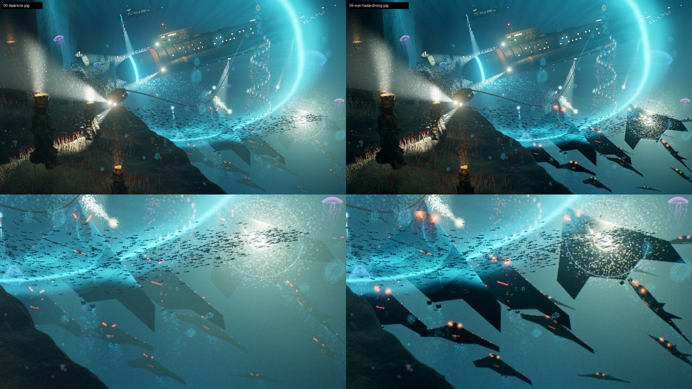
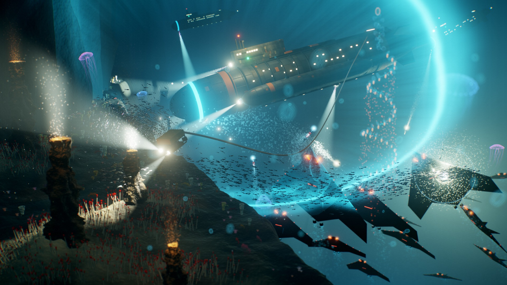

# Echoes of the Abyss 16:9 — dream-loop prototype

An isolated prototype of the 16:9 key art exported from Claude Design. Nothing outside this folder depends on it.
This folder holds a copy of the scene modules (`src/`), the loop tooling (`tools/`), every render the loop
produced (`renders/`) and a rebuilt single-file offline page.



*Left: original export. Right: after the loop. The bottom row is a 2× crop of the Directorate pack.*

## How the loop ran

- **Local only.** No fal.ai or other generative APIs. Every image is the real three.js scene, rendered in headless
  Chromium with software WebGL (SwiftShader) through Playwright. The harness reads the canvas pixels directly,
  so there's no screenshot scaling.
- **Own loop, not the skill's script.** The `optional-skills/dream-loop` Pro-workflow instructions in
  `gunnargehtab/Echoes-of-the-Abyss` were not read (the session's permission check blocked it). This is a plain
  render → critique → change → re-render cycle, judged against the design intent in the Claude Design chat that produced the key art.
- **Iteration renders:** 960×540 with 12 accumulation passes, about 85 s each on 4 CPU cores.
  **Final:** 1920×1080 with all 64 passes, rendered from the built offline file.
- **Critic:** a side-by-side sheet (full frame plus a 2× crop of the pack) and luminance percentiles from
  `tools/compare.py`. A change was kept only if the sheet looked better and nothing else in the frame moved.

## Target

The last request in that design chat: *"Make the Directorate hulls darker, so they read as hunters sneaking
in: black shapes with red lights, edges lit only where the ping reaches them."* That round shipped with a known gap:
the hunters still looked grey-teal because of the floodlit water in front of them. The loop went after that gap
without changing the camera, the composition or the lighting rig.

## Iterations

Luminance values are sRGB 0–1. "Pack" is the lower-right quarter of the frame.

| # | Change | Pack p5 / p50 | Frame p2 | Verdict |
|---|---|---|---|---|
| 00 | Baseline (original export) | 0.123 / 0.421 | 0.079 | Pack reads grey-teal; the far hunters almost vanish |
| 01 | Haze holdout on hunter materials: 70 %, fading out from 350 to 1100 units | 0.120 / 0.388 | 0.079 | Kept. Silhouettes appear and the far hunters become readable |
| 02 | Holdout 90 %, fading 400 → 1500; eyes and edge lights +30 % | 0.092 / 0.376 | 0.076 | Kept. Darker, but still tinted by bloom and the ring glow |
| 03 | Black point 0.004 after ACES | 0.067 / 0.370 | 0.046 | Kept. Real blacks; midtones and highlights unchanged |
| 04 | Red glow sprites at each hunter's sensor eyes (intensity 2.2) | 0.068 / 0.370 | 0.046 | Too faint: red light dies in the water |
| 05 | Eye glows 6 units wide, intensity 5 | 0.068 / 0.373 | 0.046 | Kept. Paired red eyes read across the whole pack |

The final still below is 1920×1080 with all 64 passes, rendered from the offline file. It took 17.7 minutes on CPU.



The eye glows come out orange-red rather than pure red, because the water absorbs red light fastest. A deeper red
means raising their red channel or intensity in `src/main.js`.

## What changed in code (vs the original export)

- **`src/engine.js`**
  - `uwMat(mat, { hold })` lets a material mark itself for haze holdout. It writes `1 - hold` into the alpha of the
    opaque buffer, which nothing used before.
  - The volume pass reads that alpha. It scales the light scattered in front of marked pixels by
    `1 - uHold · mask · fade(distance)`. Near hunters lose most of the lit haze; far ones keep more, so depth still reads.
  - The final grade has a black point, `uBlack`, applied after ACES. `0` gives the original look.
- **`src/models.js`**: the hunter hull tiles and hunter steel use `hold: 1`. Eye and edge lights are 1.3× brighter.
- **`src/main.js`**: holdout 0.9 over 400–1500 units, black point 0.004, and a red glow sprite at each sensor eye.

## Files

- `Echoes of the Abyss 16x9 - Dream Loop.html`: the self-contained offline page (784 KB). three.js and the scene are
  inlined as one module script, with no loader and no network. It takes the same `?scale=` and `?frames=` parameters,
  and **S** saves a PNG.
- `index.html`: dev entry. An importmap points at `src/` and at three.js r184 in `vendor/`.
- `renders/`: every loop render, `before-after.jpg` and `final-1920x1080.jpg`.
- `tools/render.mjs`: the headless render harness.
- `tools/compare.py`: builds the critique sheet and prints the metrics.
- `tools/build-offline.mjs`: esbuild bundle into the single HTML file.

## Reproduce

```sh
cd prototypes/keyart-dream-loop
npm install        # playwright 1.56.1 + esbuild (outside this container, also run: npx playwright install chromium)
node tools/render.mjs --scale=0.5 --frames=12 --out=renders/next.jpg
python3 tools/compare.py renders/05-eye-halos-strong.jpg renders/next.jpg renders/cmp.jpg   # needs pillow + numpy
node tools/build-offline.mjs
```

## Left alone

- The ping ring, floodlights, fish, jellies, siphonophore, vents and submarines are unchanged.
- The hunters' glowing wakes are unchanged. The design chat offered to dim them; with black hulls they still read as
  a subtle trail.
